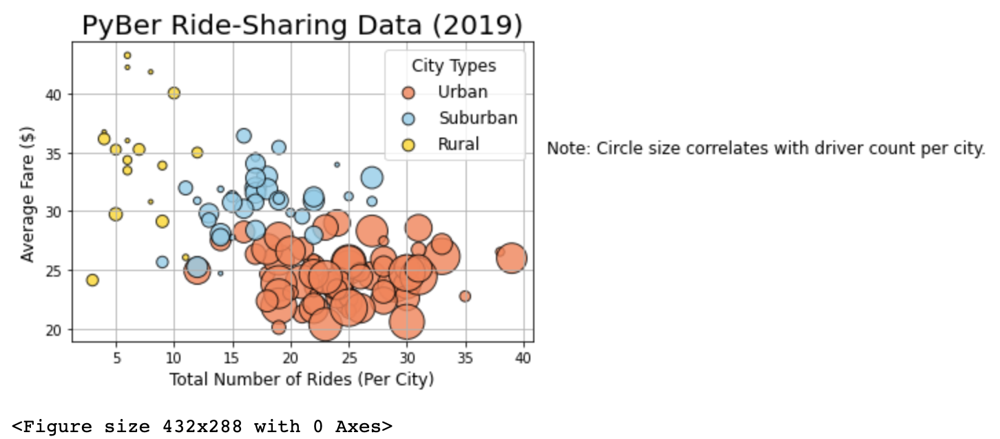
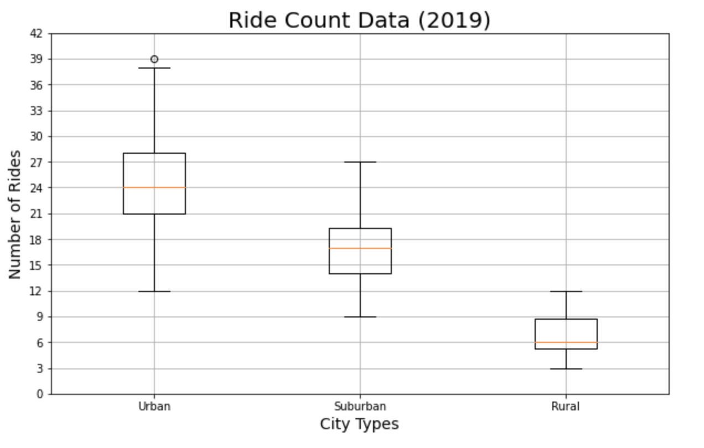
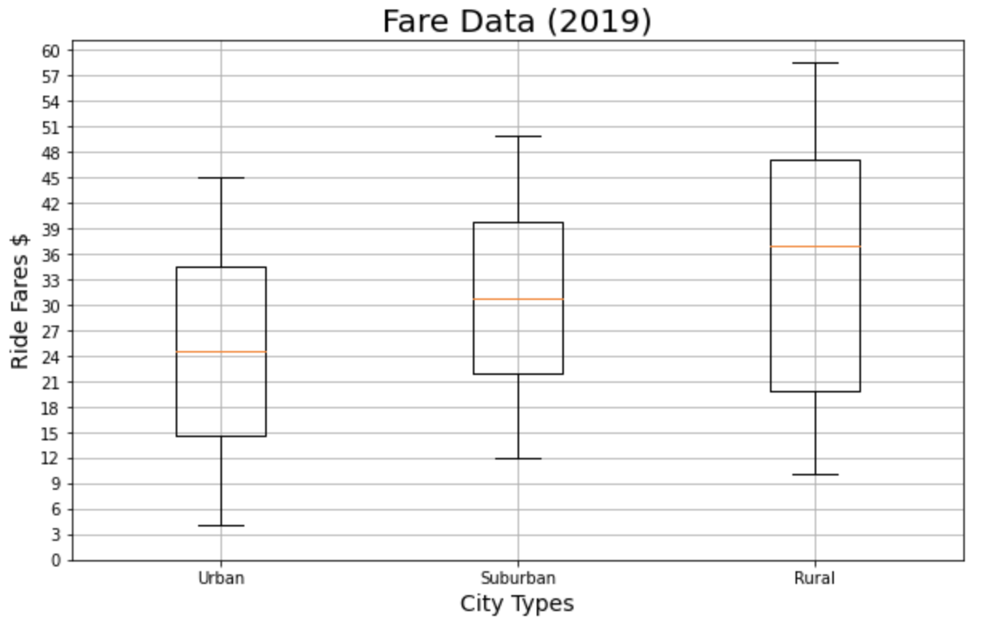
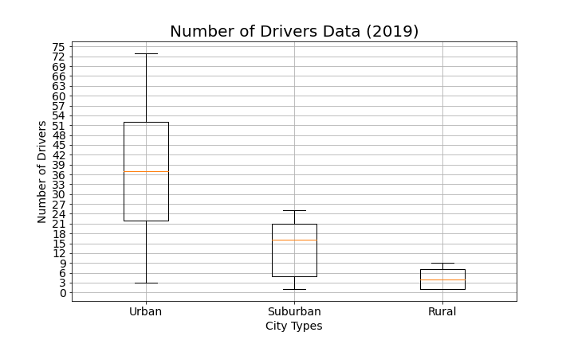
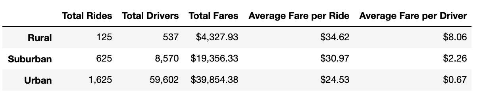
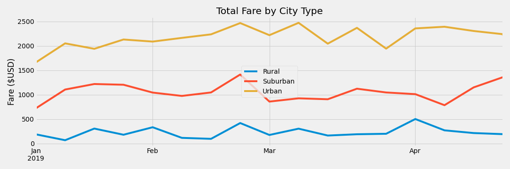

# PyBer_Analysis

## Overview
Perform analysis of ridesharing data between January to April of 2019 and present fiding in visual form using visualisation tools as well as come up with business reccomendation for the manegement.

## Resources 
- Data Source: city_data.csv, ride_data.csv
- Software: anaconda3, python 3.7.7, jupyter notebook, matplotlib library

## Results
First of all, let's create a buble chart that to visualize the initial raw data and see if any trends or correlations or anything else catches the eye right off the bat.

Next, let's use a box and whiskers plot to look through the Ride data quesrtiles and study the the variation between Urban, Suburban and Rural city types.

Similar to the previous chart, we will also use a box plot to show the variation in Ride Fare Data among the same 3 city types.

Our next box plot will show the variation in the Driver count data between the 3 city types.

Next, we will show 3 pie charts, representing Ride count, Driver count, as well as Ride fare data for the same three city types: Urban, Suburban and Rural. 

Lastly, let's show a line chart, showing the Total fare per city type data over the 4 months in 2019 and the final Data frame as well.

## Summary

It is clear that riders spend more per ride in Rural areas, which could be explained by either higher price for services or longer distance rides there.
Most of the company revenue during Jan - Apr 2019 came from Urban areas, where Total fares was the highest during that time.
At the same time, we can see that drivers in Urban areas receive a smaller average fare than Rural and Suburban drivers, which is most likely caused by higher number of drivers in urban cities.

## Business Recommendations

- The management should consider to motivate Urban drivers relocate to the Rural areas, which would even out the average fare per driver
- It might also make sense to bring more drivers out in all 3 city type areas during the last week of Feb, as we can see a spike in total fares during that time (please, see the line chart)
- The company should find a way to generate more rides in Rural and Suburban areas, where average fare per ride is more, but the combined number of rides is less than that of the Urban areas (1st pie chart shows it best)

